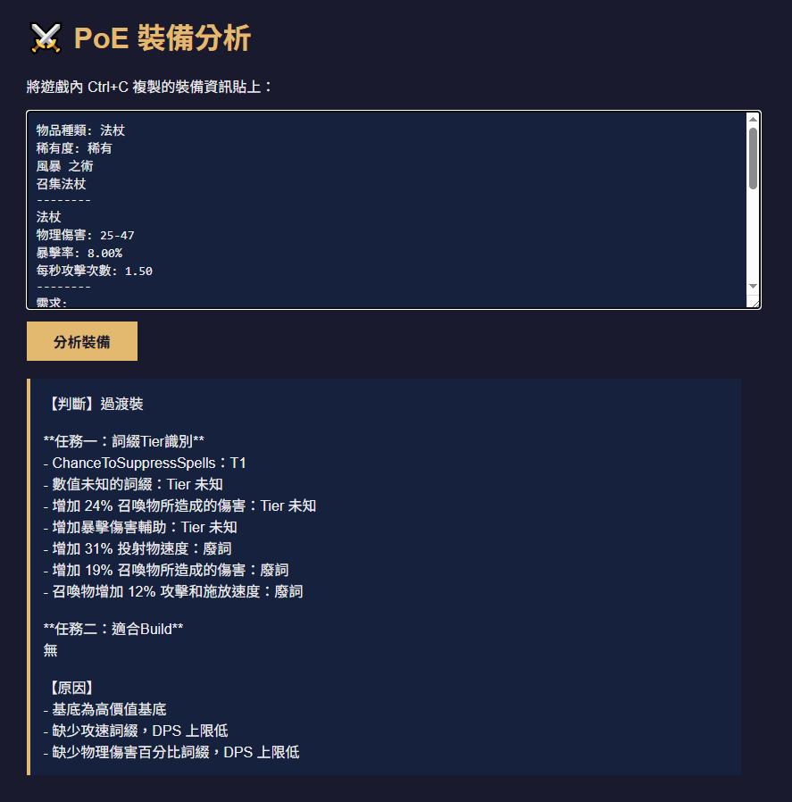

# POE Item Helper

貼上裝備資訊，AI 自動判斷價值與適合的 build。

## 範例



## 架構

```
瀏覽器 → FastAPI (port 8080)
            ├── ChromaDB (RAG 知識庫, port 8000)
            └── Ollama LLM (llama3.1:8b, port 11434)
```

## 快速開始

### 1. 啟動所有服務

```bash
docker compose up -d
```

首次啟動會拉取 image，需要幾分鐘。

### 2. 下載 LLM 模型

```bash
docker exec -it ollama ollama pull llama3.1:8b
```

> 模型約 4.7 GB，下載時間依網速而定。
> 若有 NVIDIA GPU，Ollama 會自動啟用 GPU 加速。

### 3. 匯入 RAG 知識庫

```bash
# 轉換 RePoE 詞綴資料（需先有 knowledge/repoe/mods.json）
docker exec poe-helper python convert_repoe.py

# 匯入所有知識庫到 ChromaDB
docker exec -e CHROMA_HOST=chromadb poe-helper python import_knowledge.py
```

匯入完成後會顯示：
```
✅ 匯入完成，共 X 筆資料
✅ 匯入完成，共 X 個詞綴群組
```

### 4. 開啟介面

瀏覽器前往：[http://localhost:8080](http://localhost:8080)

貼上遊戲內複製的裝備資訊（`Ctrl+C` 複製裝備），送出後等待 AI 分析。

---

## 知識庫資料來源

| 檔案 | 說明 |
|------|------|
| `app/knowledge/poe_mods.txt` | 手動整理的詞綴價值評估規則 |
| `app/knowledge/repoe/mods.json` | RePoE 完整詞綴資料庫 |
| `app/knowledge/converted/mods_converted.txt` | 由 `convert_repoe.py` 轉換輸出 |

RePoE 資料可從 [https://github.com/brather1ng/RePoE](https://github.com/brather1ng/RePoE) 取得。

---

## 常用指令

```bash
# 啟動所有服務
docker compose up -d

# 查看 API log
docker logs poe-helper -f

# 停止所有服務
docker compose down

# 確認 ChromaDB 是否正常
curl http://localhost:8000/api/v2/heartbeat

# 確認 Ollama 是否正常
curl http://localhost:11434/api/tags
```

## 更換 LLM 模型

編輯 [app/rag.py](app/rag.py) 第 14 行：

```python
llm = OllamaLLM(base_url=OLLAMA_URL, model="llama3.1:8b")
# 改成其他模型，例如：
llm = OllamaLLM(base_url=OLLAMA_URL, model="qwen2.5:14b")
```

可用模型清單：`docker exec -it ollama ollama list`
